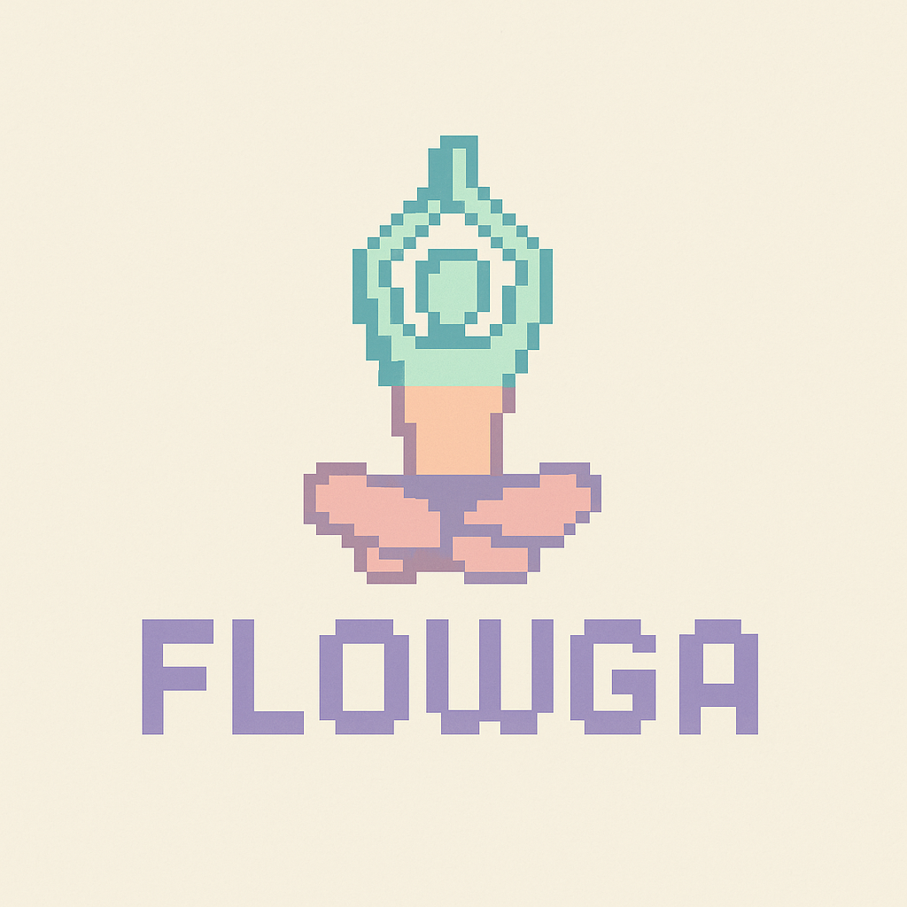

# 

Your Personal AI Yoga Instructor, right in your terminal.

Flowga is a privacy-first, local-only application that uses your webcam and the power of Vision Language Models (VLMs) to provide real-time feedback on your yoga poses. It combines a rich terminal interface with an optional live video feed to guide your practice, track your sessions, and help you improve your alignment.

> [!NOTE]
> Flowga is a prototype project. While fully functional, it has not been tested on a wide range of hardware. Feedback and contributions are welcome!

## Features

- **Real-Time Pose Detection**: Uses MediaPipe to accurately detect 33 different body landmarks in real-time.
- **AI-Powered Feedback**: Leverages a local Vision Language Model (via Ollama) to identify poses, provide constructive feedback, and score your alignment.
- **Privacy First**: 100% local. No data ever leaves your machine. No internet connection required after setup.
- **Rich Terminal UI**: A beautiful and functional dashboard built with Rich shows your pose history, session timers, and AI feedback.
- **Optional Video Window**: Enable a live, mirrored webcam feed with data overlays showing your pose, score, and feedback.
- **Text-to-Speech (TTS)**: Get instant audio feedback on your alignment without needing to look at the screen.
- **Session Tracking**: Automatically logs the duration you hold each pose and displays a summary at the end of your session.
- **Customizable Theme**: A consistent, Nord-inspired color palette is used across the entire application, and can be easily customized.

## Technical Architecture

Flowga is built on a modular, event-driven loop within a single Python script. The data flows through the system as follows:

1.  **Input (OpenCV)**: Captures frames from the webcam.
2.  **Detection (MediaPipe)**: Processes each frame to extract pose landmark coordinates.
3.  **Analysis (Ollama VLM)**: On a throttled timer, the current frame and landmarks are sent to a local VLM (e.g., `qwen2-vl:7b`) to generate feedback. The model returns a JSON object containing the pose name, a feedback sentence, and a score.
4.  **Output (Rich, OpenCV, pyttsx3)**: 
    - The terminal dashboard is updated with the latest data.
    - The feedback is spoken aloud using TTS in a non-blocking thread.
    - If enabled, the feedback is drawn onto the video frame as a text overlay.
5.  **Tracking (Python)**: A custom logic module tracks the time spent in each pose and compiles a session summary.

## Setup

### Prerequisites

- Python 3.10+
- [Ollama](https://ollama.com/) installed and running.

### Installation

1.  **Clone the repository:**
    ```bash
    git clone https://github.com/Keshy31/flowga
    cd flowga
    ```

2.  **Create and activate a virtual environment:**
    ```bash
    python -m venv venv
    source venv/bin/activate  # On Windows, use `venv\Scripts\activate`
    ```

3.  **Install the required packages:**
    ```bash
    pip install -r requirements.txt
    ```

4.  **Pull the Ollama model:**
    Flowga is optimized for smaller VLMs. We recommend `qwen2-vl:7b`.
    ```bash
    ollama pull qwen2-vl:7b
    ```

## Usage

Run the application from your terminal:

```bash
python yoga_tui.py
```

### Command-Line Options

-   `--video-window`: Display the webcam feed in a separate GUI window with text overlays.
-   `--model <model_name>`: Specify which Ollama VLM model to use (default: `qwen2-vl:7b`).
-   `--analysis_interval <seconds>`: Set the time between analysis calls to the VLM (default: `5`).

**Example with video window:**
```bash
python yoga_tui.py --video-window
```

## License

This project is released into the public domain. See the [LICENSE](LICENSE) file for details.
